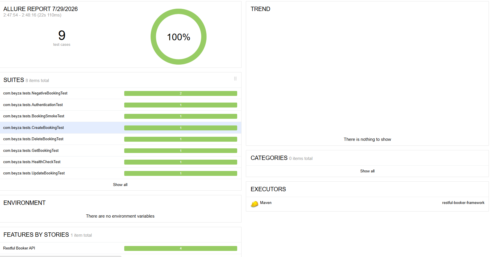

# REST Assured API Test Automation Framework


A REST API Test Automation Framework built with **Java 21**, **JUnit 5**, **Rest Assured**, **Maven**, **Allure Report**, and **GitHub Actions**.

This project demonstrates a scalable API automation framework using the [Restful Booker API](https://restful-booker.herokuapp.com).

---

## Tech Stack

- Java 21
- Maven
- JUnit 5
- Rest Assured
- Jackson
- DataFaker
- Allure Report
- GitHub Actions

---

## Project Structure

```
src
├── main
│   └── java
│       └── com.beyza
│           ├── builders
│           ├── client
│           ├── config
│           └── models
│
└── test
    ├── java
    │   └── com.beyza
    │       ├── base
    │       └── tests
    └── resources
```

---

## Design Decisions

- **Builder Pattern** is used to construct test data (bookings) in a flexible and readable way, avoiding long constructors and making it easy to create variations of test data for different scenarios.
- **Client Layer** separates raw API calls from test logic, so tests stay focused on assertions rather than request/response handling.
- **POJO Models** with Jackson provide type-safe serialization/deserialization between Java objects and JSON payloads.
- **DataFaker** generates dynamic, realistic test data instead of hardcoded values, reducing test data collisions and improving test reliability.
- **Config Reader** centralizes environment configuration, keeping base URLs and settings out of the test code.
- **Independent CRUD tests** isolate each operation for clearer failure diagnosis, while a dedicated **Smoke Test** validates the full booking lifecycle end-to-end in a single flow.

---

## Test Scenarios

### Positive Tests
- Authentication
- Create Booking
- Get Booking
- Update Booking
- Delete Booking
- Health Check

### Negative Tests
- Invalid Booking ID returns **404**
- Invalid Token returns **403**

### Smoke Test
- Full CRUD lifecycle in a single end-to-end flow (see [Smoke Test Flow](#smoke-test-flow) below)

---

## Smoke Test Flow

```
Get Authentication Token
          │
          ▼
Create Booking
          │
          ▼
Retrieve Booking
          │
          ▼
Update Booking
          │
          ▼
Delete Booking
          │
          ▼
Verify Booking No Longer Exists
```

This end-to-end smoke test validates the complete booking lifecycle in a single flow, complementing the independent CRUD tests. Each run creates and cleans up its own data, so no shared state or leftover data affects subsequent test runs — no booking ID is stored globally.

---

## Features

- Layered Architecture (Client / Model / Builder / Test separation)
- Builder Pattern
- Client Layer
- POJO Models
- Dynamic Test Data (DataFaker)
- Reusable Base Test
- End-to-End Smoke Test
- Allure Reporting
- GitHub Actions CI (runs on every push)
- Request & Response Logging (on failure)

---

## Prerequisites

- [Java 21](https://www.oracle.com/java/technologies/downloads/) installed and configured (`JAVA_HOME` set)
- [Maven](https://maven.apache.org/download.cgi) installed
- (Optional) [Allure Commandline](https://docs.qameta.io/allure/#_installing_a_commandline) installed for local report generation

---

## Getting Started

Clone the repository:

```bash
git clone https://github.com/beyzaozgeee/restful-booker-framework.git
cd restful-booker-framework
```

Run the tests:

```bash
mvn clean test
```

---

## Generate Allure Report

```bash
allure serve target/allure-results
```

or

```bash
allure generate target/allure-results --clean
```

Or, using the Maven plugin directly (no separate Allure installation required):

```bash
mvn allure:serve
```
### Sample Report


---

## Continuous Integration

GitHub Actions automatically runs all tests on every push and pull request.
Workflow file: [`.github/workflows/maven.yml`](.github/workflows/maven.yml)

---

## API Under Test

[https://restful-booker.herokuapp.com](https://restful-booker.herokuapp.com)

---

## Author

**Beyza Özge Abay**
Junior QA Engineer

- GitHub: [github.com/beyzaozgeee](https://github.com/beyzaozgeee)
- LinkedIn: [linkedin.com/in/beyza-özge-abay](https://www.linkedin.com/in/beyza-%C3%B6zge-abay-8abb20397/)
